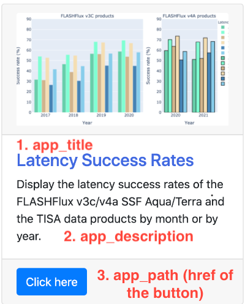

# NASA FLASHFLUX TEAM INTERNAL SITE

This is a lightweight website written in Python Flask/Dash/Plotly (backend) and Bootstrap HTML/CSS (frontend).
The main purpose of this site is to share the Python Plotly figures with group members. Dash is utilized for 
realtime interactive plots.


## Environment

### Python version requirement
A minimum version of Python 3.8 is required for this project. Older versions are not supported. 
Please install an appropriate version of Python.


### Running the Python virtual environment
This project utilizes the Python virtual environment to pack all the needed packages to `requirements.txt`.

- For the first time usage, running the bash script with `sh start_venv.sh`.
- Then each time to edit the project, you can follow *either* of the following to start the virtual environment:
    1. Command line: `source .venv/bin/activate`. You will find the difference in the shell screen.
    2. IDE (PyCharm, in my case): follow the instructions 
   [here](https://www.jetbrains.com/help/pycharm/configuring-python-interpreter.html) 
   and set the Python interpreter as `$current_folder$/.venv/bin/python3`.
- After adding more modules into the environment, please use `python3 -m pip freeze` to update `requirements.txt`.
A reference can be found [here](https://packaging.python.org/guides/installing-using-pip-and-virtual-environments/).
  
## Description
### Folder structure


Above is the screenshot of the project. Its main structure is described below.
- `requirement.txt`,`start_venv.sh`, `.venv/`: Python environment related.
- `.env`, `config.py`: global Flask configuration files. `config.py` parse the parameters
  in `.env` and pass them to the Flask server. 
  Change `.env` when needed, especially with the deployed version.
  The official documentation is [here](https://flask.palletsprojects.com/en/1.1.x/config/).
- `/apps/__init__.py`: register the Flask and the Dash apps. Change them when you create 
more Dash apps.
- `/apps/routes.py`: define the mapping of the webpage url addresses to the static html 
  files for each sub page of the website. The documentation of the Flask routing rules can 
  be found [here](https://flask.palletsprojects.com/en/1.1.x/quickstart/#routing). 
  It must be changed when you add more sub pages.
- `/apps/common_app_layouts.py`: define the common Dash components for all the Dash apps.
  Now it includes a main container, with a return to homepage button at the bottom.
  Change it to meet your own designs.
- `/apps/templates/`: all the static html files defined by `/apps/routes.py` have to be 
  located here. These html files are independent of the Dash pages created by pure Python. 
  Change them when needed.
- `/apps/static/`: all the site-related static files, including `styles.css` and the images.
Note that `.js` files are also supported though I have not succeeded yet.
- `/apps/data/`: all the related data for the real-time plots. I use different folders 
for diverse Dash apps.
- `/apps/dashapp_latency/`: all the files related to the latency Dash app. 
  Create another folder named as "dashapp_xxxx" under `/apps` and register them 
  in `/apps/__init__.py` if you add more Dash apps.

### Backend
The backend mainly consists of Python Dash+Plotly apps. 
Each app is within a folder named as `./apps/dashapp_xxx`. 
For example, the latency plot app is within `./apps/dashapp_latency`.

### Frontend
The static html files have to be in the folder `/apps/templates/`. 
Flask will automatically search this location. Inappropriate processes may cause error.

Note that although the html pages are static, some contents can be passed through Python. 
Below I demonstrate how I render the homepage with Python and html together.

The Homepage is scripted in `/apps/templates/index.html`. It's a gallery entry for the Dash apps.

The html code for each app is marked below. Note that the three variables `app_1_latency_title`, 
`app_1_latency_description` and `app_1_latency_path` are passed through `/apps/route.py`. A screenshot 
of the first app is uploaded for your better understanding

```html
        <!-- One dash plot entry is represented with one Bootstrap Card-->
        <div class="col-sm-4">
            <div class="card">
                <div class="card-header">
                    <!-- image size: height: 200px, width: 375px-->
                    
                </div>

                <div class="card-body">
                    <!-- things in the double quoted brace are passed through `./apps/routes.py` -->
                    <h4 class="dash-app-title">{{ app_1_latency_title }}</h4>
                    <p class="card-text">
                        {{ app_1_latency_description }}
                    </p>
                </div>
                <div class="card-footer">
                    <a href={{ app_1_latency_path }} class="btn btn-primary">Click here</a>
                </div>
            </div>
        </div>
```

```python
@server_bp.route("/")
def render_page_home():
    """Render the homepage."""
    return render_template(
        "index.html",    # a html file at "./templates"
        # parameters for the first Dash app
        app_1_latency_title=HTML_APP_LATENCY_TITLE,  # 1. app_title
        app_1_latency_description="Display the latency success rates of the FLASHFlux v3c/v4a SSF Aqua/Terra and the "
                                  "TISA data products by month or by year.",  # 2. app_latency
        app_1_latency_path=HTML_APP_LATENCY_PATH,   # 3. the url for the app
```




## Deployment

### Configuring Apache
[TODO] NASA is using Apache to host the websites.
- [ ] [Apache reference](https://flask.palletsprojects.com/en/1.1.x/deploying/mod_wsgi/)

### Revising codes for production usage
- Change `.env`. Now all the configuration parameters are written in `.env`. 
  Please modify it when deployed, especially for `FLASK_ENV=development`. 
  By default, the value of `FLASK_ENV` is `production`.
  Do not enable `development` when deploying in production by deleting this line.
```python
FLASK_APP=dashapp.py     # the main function entry
FLASK_ENV=development    # delete this line when deployed
SECRET_KEY=NASA#FLASHFlux$RandomStrings   # a security key, use more secure ones when deployed
LESS_BIN=/usr/local/bin/lessc
ASSETS_DEBUG=False
LESS_RUN_IN_DEBUG=False
COMPRESSOR_DEBUG=True
```
  
- In `/apps/constants.py`, change `HTML_HOME_PATH` to the true homepage url address when deployed.
```python
# url paths for the dash plot apps
HTML_HOME_PATH = "http://127.0.0.1:5000"   # IMPORTANT: change it to the true url address when deployed
```

## Updating web contexts
### Latency charts
- Source data location: `apps/data/latency/*.csv`. 
  Replacing the files in this folder to update the plots at the webpage endpoint.
- Naming rules:
  1. Monthly latency data files are named as "typestr_vstr_SR_by_month.csv",
  2. Annual latency data files are named as "vstr_latency_by_year.csv"

    where `typestr` is one of "Aqua", "Terra" or "TISA", and `vstr` is "Version3C" or "Version4A".
- The location and the file names are hardcoded in the backend scripts. Please follow them to save time.  
- The source data files are got through 
  the [automatic latency statistic scripts](https://github.com/cissieAB/LatencyResample). 
  Copying the results from there is recommended.
  
### More Dash apps
Follow the processes below to create a new Dash app and merge it to the existing code base:
- Create the `layout` and the `callback` Dash functions based on your design.
- Register this app in `/apps/__init__.py`.
- Change the html template in `/apps/templates/index.html` when needed. 

Please refer to 
[the git commit](https://github.com/cissieAB/Flask_Plotly_Dash_Site/commit/a92429d6214b5f7bafc5c403166d22b57b1e51a4)
 for how I added the second demo app.
 

## References
- [Flask official documentation](https://flask.palletsprojects.com/en/1.1.x/)
- [Deploy Flask with Apache](https://flask.palletsprojects.com/en/1.1.x/deploying/mod_wsgi/)
- [Dash official documentation](https://dash.plotly.com/)
- [Bootstrap official documentation](https://getbootstrap.com/)
- [Bootstrap templates](https://www.w3schools.com/bootstrap/bootstrap_templates.asp)
- [Dash Bootstrap components](https://dash-bootstrap-components.opensource.faculty.ai/)
- [How to embed a Dash app into an existing Flask app](https://medium.com/@olegkomarov_77860/how-to-embed-a-dash-app-into-an-existing-flask-app-ea05d7a2210b#bd30)
